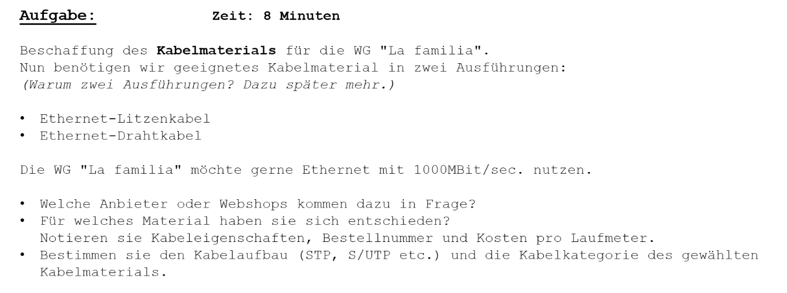

# Kabelauswahl für WG „La familia“

Die WG „La familia“ möchte ein Heimnetzwerk mit **1000 Mbit/s (Gigabit-Ethernet)** aufbauen. Es werden zwei Arten von Ethernet-Kabeln benötigt:

- **Litzenkabel** (flexibel, z. B. für Geräteanschlüsse)
- **Drahtkabel** (starr, z. B. für feste Verlegung)

---

## 1. Geeignete Anbieter / Webshops

- [reichelt.de](https://www.reichelt.de)
- [conrad.de](https://www.conrad.de)
- [digitalo.de](https://www.digitalo.de)
- [fs.com](https://www.fs.com/de)
- [amazon.de](https://www.amazon.de)

---

## 2. Auswahl und Eigenschaften

### 🧷 Litzenkabel (z. B. für PC → Wanddose)

- **Typ**: Cat 6 Patchkabel
- **Aufbau**: S/FTP (Screened Foiled Twisted Pair)
- **Material**: Litze (flexibel)
- **Kategorie**: Cat 6
- **Geschwindigkeit**: bis 1 Gbit/s (250 MHz)
- **Shop**: reichelt.de
- **Artikelname**: S/FTP Patchkabel Cat 6, grau
- **Beispiel-Bestellnummer**: S/FTP-PATCH-5-G
- **Kosten**: ca. 1,80 €/m

### 🧱 Drahtkabel (z. B. für Wandverlegung)

- **Typ**: Cat 7 Verlegekabel
- **Aufbau**: S/FTP (Einzel- und Gesamtschirmung)
- **Material**: Draht (starr)
- **Kategorie**: Cat 7
- **Geschwindigkeit**: bis 10 Gbit/s (600 MHz)
- **Shop**: conrad.de
- **Artikelname**: Verlegekabel Cat 7, 4x2xAWG23
- **Beispiel-Bestellnummer**: KABEL CAT7 100m
- **Kosten**: ca. 0,90 €/m

---

## 3. Warum zwei Ausführungen?

| Kabeltyp       | Verwendung                     | Vorteil                         |
|----------------|--------------------------------|----------------------------------|
| **Litzenkabel** | Patchkabel (z. B. PC → Switch) | flexibel, beweglich             |
| **Drahtkabel**  | Feste Installation in Wänden   | stabil, langlebig bei Verlegung |

---

*Diese Auswahl deckt die Anforderungen an ein Gigabit-Netzwerk ab und bietet eine klare Trennung zwischen beweglichen und festen Verbindungen.*
